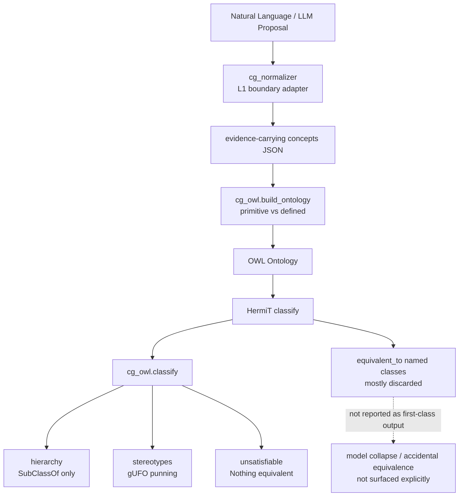
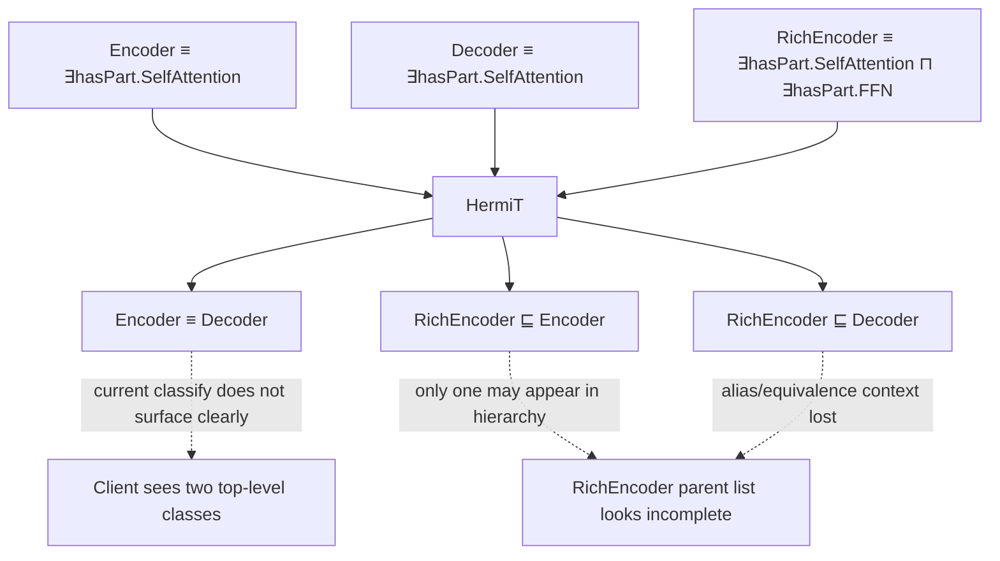
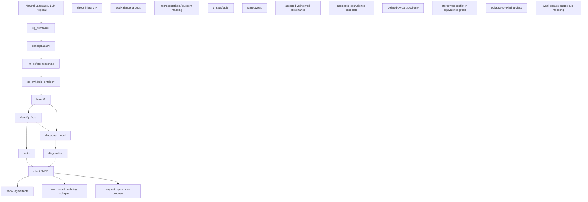
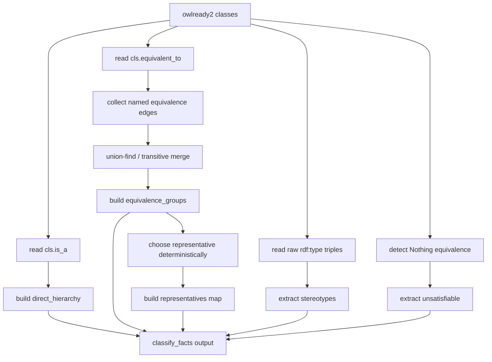
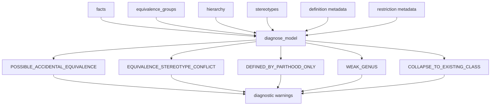
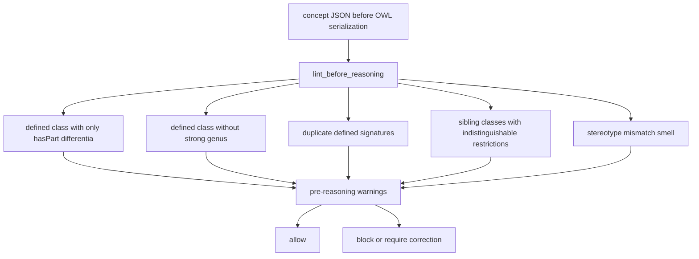
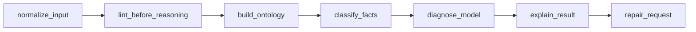
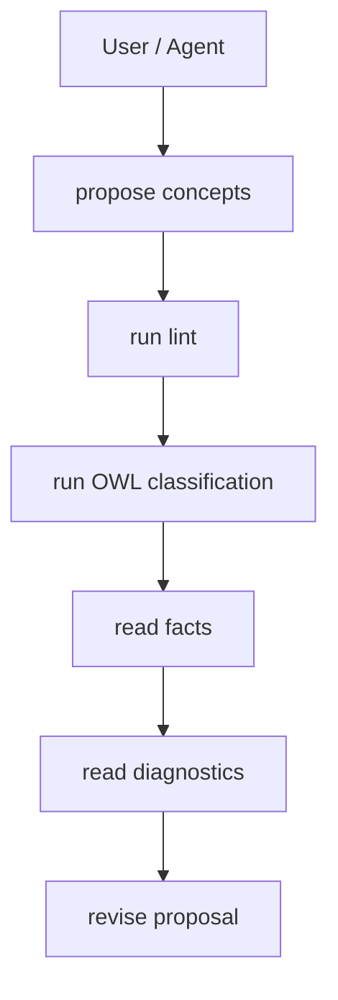
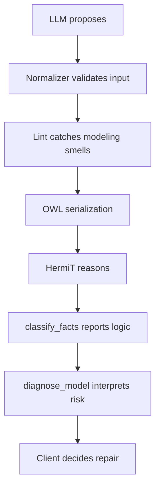

# 설계 리뷰 피드백 — cg_owl 파생 동치 보고 + 코어 전략

- 수신 일시: 2026-07-16 01:40:00 UTC
- 대상: `cg_owl.classify()`의 파생 동치(equivalence) 보고 설계 변경 및 코어 설계 전략
- 맥락: 적대적 검증에서 발견한 약점 A(파생 동치 미보고)·B(동치 부모 일부 누락)에 대한
  2-pass 수정 제안(`docs/feedback` 밖의 세션 논의)에 대한 외부 리뷰어 피드백 원문

> 이 문서는 리뷰어 피드백을 **원문 그대로** 보존한다. 실제 코드 반영 여부·범위는
> 별도 결정 사항이며, 여기 담긴 주장은 검토 대상이지 확정 설계가 아니다.

---

## 결론

이전 요약의 다섯 항목은 대체로 맞습니다. 다만 더 정확히 말하면:
* **"의미적 일반화가 약함"**은 사실상 **의도된 설계 선택**입니다.
* **"문자열 동치성 의존"**은 단순한 한계가 아니라, 현재 코어의 **핵심 추론 규칙**입니다.
* **"semantic typing 규칙 기반"**은 맞고, 코드 수준에서 꽤 하드코딩되어 있습니다.
* **"heuristic expansion은 수렴성 우선"**도 맞고, 실제로 품질보다 PASS 유도 쪽으로 설계돼 있습니다.
* **"validator/orchestrator 성격"** 역시 맞고, 저장소 스스로도 그렇게 설계했다고 밝힙니다.

아래에서 코드 레벨로 하나씩 검증하고, 비판과 개선 전략을 적겠습니다.

---
## 1) 의미적 일반화가 약함
### 코드 근거
README는 `is-a` edge가 **essential label의 문자열 그대로 부분집합 포함**일 때만 생성된다고 명시합니다. 개념명만으로는 결론을 내리지 않으며, 부모의 essential label을 자식이 verbatim으로 반복해야 합니다.

코드도 그대로입니다.

* `NormalizedConcept.essential_attrs`는 feature의 **문자열 집합**만 반환합니다.
* `DAGReasoner.collect_ancestors()`는 `p.essential_attrs < c.essential_attrs`로 조상을 판단합니다.
* `direct_parents()`도 동일한 집합 포함 관계로 direct parent를 고릅니다.

### 비판

이 구조에서는 아래가 모두 실패합니다.

* 동의어: `포유류` vs `젖먹이동물`
* 표기 변형: `가축화` vs `인간에 의해 가축화됨`
* 패러프레이즈: `직각을 가진다` vs `네 각이 모두 직각이다`

즉, **의미적 subsumption이 아니라 label identity 기반 subsumption**입니다.
이건 설명 가능성은 높지만, 실제 텍스트에서 얻은 feature가 조금만 다르게 표현돼도 계층이 깨집니다.

더 직접적으로 말하면, 이 코어는 **feature semantics를 추론하지 않고 feature label equality를 추론**합니다.

### 개선 전략

#### A. `feature_id`를 도입

`NormalizedFeature`에 `feature_id`를 추가하고, DAG 비교는 `feature` 문자열이 아니라 `feature_id` 기준으로 하세요.

```python
@dataclass
class NormalizedFeature:
    feature: str
    feature_id: Optional[str] = None
    type: FeatureType = FeatureType.ESSENTIAL
    evidence: str = ""
```

그 다음:

* `essential_attrs`는 raw label이 아니라 canonical id 집합을 반환
* label은 display용으로만 유지
* `cg_normalizer.lookup_senses()`와 유사하게 feature inventory/crosswalk를 둠

#### B. 2단계 비교로 분리

1단계: strict id match
2단계: alias/equivalence resolution

이렇게 하면 현재의 결정론은 유지하면서도 일반화가 생깁니다.

#### C. semantic candidate generation은 허용하되 edge commit은 보수적으로

임베딩이나 LLM으로 "후보 feature equivalence"를 제안할 수는 있지만, 실제 edge commit은 **검증된 canonical mapping**만 허용하는 게 좋습니다.

---

## 2) 문자열 동치성에 많이 의존함

### 코드 근거

이건 1번과 연결되지만, 더 직접적인 증거도 있습니다.

* `PreDAGSignatureGate`는 같은 essential signature를 exact-equality로 탐지합니다.
* `PostDAGSiblingGate`도 sibling 간 `c.essential_attrs == sib.essential_attrs`일 때만 종차 부족으로 판정합니다.

즉, underspecification 탐지도 semantic similarity가 아니라 **집합의 정확한 일치**에 의존합니다.

### 비판

이건 단순한 "보수적 설계"를 넘어, 다음 부작용이 있습니다.

* 사실상 같은 개념인데 표현이 다르면 중복 탐지가 안 됨
* 반대로 우연히 같은 짧은 라벨을 쓰면 실제 의미가 달라도 같은 signature로 묶임
* sibling under-specification 탐지가 lexical artifact에 좌우됨

즉, 현재 signature는 ontology signature가 아니라 **surface-form signature**입니다.

### 개선 전략

#### A. signature를 raw string set에서 normalized token/object set으로 승격

예:

* `feature_id`
* `sense_id`
* `canonical_form`
* `constraints` 묶음

으로 signature를 구성하세요.

#### B. surface signature와 semantic signature를 분리

* `surface_signature`: 현재 방식 유지
* `semantic_signature`: canonicalized features 기반

그 후:

* 경고는 surface 기준으로도 낼 수 있음
* 실제 분류/중복 판정은 semantic 기준으로 수행

#### C. auditability 유지

현재 장점은 디버깅이 쉽다는 점입니다.
그래서 raw label을 버리지 말고 아래 같이 함께 저장하는 게 좋습니다.

```python
edge_meta[(pn, cn)] = {
  "diff_ids": [...],
  "diff_labels": [...]
}
```

---

## 3) semantic typing이 규칙 기반이라 언어/도메인 확장성이 낮음

### 코드 근거

`SemanticTypeInference`는 사실상 한국어 문자열 마커 룰셋입니다.

* `COMBOS`
* `SINGLE_STRONG`
* `_EXACT_MATCH`
* `ESSENTIAL_EXCEPTIONS`
* `_scan()`의 substring / exact match 기반 판정

그리고 `infer()`는 feature/evidence/claim을 문자열로 내려보고, 예외면 essential, 마커면 contextual/structural 등으로 판정합니다.

### 비판

이건 다음 문제를 가집니다.

#### A. 한국어 특정 표현에 과적합

현재 마커는 한국어 어절 수준에 가깝습니다.
영어, 혼합어, 학술 용어, 도메인별 jargon에 약합니다.

#### B. substring heuristic의 오탐/누락

예를 들어 feature/evidence 안에 우연히 특정 토큰이 들어가면 오분류될 수 있습니다.

#### C. 룰이 코드에 하드코딩됨

도메인 확장 시 Python 코드 수정이 필요합니다.
운영 환경에서 규칙을 교체하거나 A/B 테스트하기 어렵습니다.

### 개선 전략

#### A. 규칙을 코드에서 설정 파일로 분리

`semantic_type_rules.ko.yaml`, `semantic_type_rules.en.yaml` 같은 식으로 빼세요.

* exact markers
* regex markers
* domain overrides
* exception list

을 external config로 두면 유지보수가 급격히 쉬워집니다.

#### B. 3단계 판정기로 바꾸기

1. relation_hint 있으면 최우선
2. declarative rule pack 적용
3. 불확실하면 `UNKNOWN` 또는 `NEEDS_CORRECTION`

지금처럼 억지로 essential로 떨어뜨리기보다 **abstain**이 필요합니다.

#### C. normalizer의 검증 정보를 코어로 전달

중요한 문제 하나는, normalizer는 `verification_status`를 별도로 관리하라고 명시하는데, 코어의 `NormalizedFeature`에는 그 필드가 없습니다.

즉, 경계층에서 확보한 검증 정보가 core inference에 충분히 반영되지 못합니다.

이건 구조적으로 아쉽습니다.
`NormalizedFeature`에 최소한 아래가 있어야 합니다.

```python
verification_status: str = "unverified"
source_span: Optional[dict] = None
source_hash: Optional[str] = None
```

그러면 semantic typing도 "문자열 기반 추정"이 아니라 "검증된 relation proposal"을 우선 사용할 수 있습니다.

---

## 4) heuristic expansion은 품질보다 수렴성 우선

### 코드 근거

`HeuristicExpansionGenerator`의 fallback은 lexicon에 없으면 아래를 넣습니다.

* feature: `"{개념명}_고유속성"`
* evidence: `"{개념명}을(를) 다른 개념과 구분하는 고유한 본질적 속성"`

또 `run_with_expansion()`은 확장 후 다시 `run()`에 넣고, 상태가 `PASS`가 되면 종료합니다.

### 비판

이건 명백히 **PASS를 만들기 위한 syntactic filler**가 될 수 있습니다.

예를 들어:

* `개` → `개_고유속성`
* `고양이` → `고양이_고유속성`

이렇게만 넣어도 essential set이 달라지므로 signature 충돌은 사라집니다.
하지만 이건 ontology 품질을 올린 것이 아니라 **검사기를 만족시키는 토큰을 추가한 것**입니다.

즉, 현재 heuristic expansion은 "differentia discovery"가 아니라 "collision breaking"에 가깝습니다.

또 `ExpansionHistoryAnalyzer`의 진동 감지도 `(status, n_concepts)`만 비교합니다. feature 내용이 달라도 개수와 status가 같으면 oscillation으로 오인할 수 있습니다.

### 개선 전략

#### A. self-name-derived feature 금지

다음 패턴은 expansion 단계에서 reject하세요.

* feature가 concept name을 그대로 포함
* evidence가 템플릿 문장만 있고 source-grounded span 없음

예:

```python
if cname in feature_name:
    reject("tautological differentia")
```

#### B. expansion에 evidence contract 추가

현재 코어는 evidence 길이와 placeholder만 검사합니다.
하지만 "실제 출처에 의해 뒷받침되는가"는 코어가 보지 않습니다.

확장 결과에는 최소한 다음이 필요합니다.

* source hash
* span
* verification_status >= source_span_verified

없으면 `CORRECTION`으로 되돌리는 게 맞습니다.

#### C. ExpansionQualityGate 추가

새 게이트를 두고 다음을 검증하세요.

* tautology 금지
* concept-name echo 금지
* feature novelty
* evidence groundedness
* sibling discriminative power

#### D. history 분석을 semantic diff 기준으로

`(status, n_concepts)` 대신

* sorted essential signature hash
* expansion action hash
* feature delta hash

로 비교해야 합니다.

---

## 5) autonomous search reasoner라기보다는 validator/orchestrator 성격이 강함

### 코드 근거

이건 저장소가 스스로 밝힙니다.

* normalizer: "LLM을 호출하지 않는다. agent가 제안하고, 이 모듈은 확인 가능한 조건만 결정론적으로 판정한다."
* README: 권장 호출 순서가 `source evidence → atomic features → lint_concepts → run_pipeline` 입니다.
* server: "이 서버는 LLM을 호출하지 않는다. MCP client가 expansion_actions를 해석하고 종차를 제공한다."
* `ExpansionPlanner`도 "LLM을 호출하지 않음. 무엇을 해야 하는가만 결정."이라고 적혀 있습니다.

### 비판

이건 결함이라기보다 **정체성 문제**입니다.

현재 이름이 "taxonomy reasoner" 쪽으로 들리지만, 실제 코어는:

* 생성기(generator)
* 검색기(searcher)
* 반례 탐색기
* 증거 수집기

가 아니라,

* 검증기(validator)
* 구조 분리기
* 상태 분류기
* 수정 액션 플래너

입니다.

따라서 "autonomous reasoner"라고 부르면 기대와 실제가 어긋납니다.

### 개선 전략

#### A. 명확한 제품 포지셔닝

이 코어를 **Concept Taxonomy Validator / Ontology Gate Engine**으로 명확히 부르세요.

#### B. 진짜 추론기 레이어를 별도 추가

autonomous reasoner를 원하면 코어 밖에 아래를 추가해야 합니다.

1. **Evidence Retriever**
2. **Feature Proposer**
3. **Counterexample Finder**
4. **Expansion Generator**
5. **Verifier** ← 현재 코어

즉, 현재 코어는 추론 스택의 verifier/orchestrator 슬롯입니다.

#### C. MCP surface를 multi-tool state machine으로 확장

실제 MCP라면 다음 도구군이 있어야 "reasoner"에 가까워집니다.

* `retrieve_sources`
* `propose_features`
* `propose_relation_type`
* `run_pipeline`
* `explain_failure`
* `request_missing_evidence`

지금 구조는 `run_pipeline` 중심이라 검증은 강하지만 탐색은 약합니다.

---

## 추가로 보이는 코드 레벨 이슈 3개

### 1) `ResultClassifier.classify()` 시그니처가 낡아 보임

`classify(reports, repairs, warnings, sig_issues, dag_has_edges)`로 받지만, 본문에서 `sig_issues`와 `dag_has_edges`를 실제로 쓰지 않습니다.

이건 두 가지 가능성이 있습니다.

* 예전 설계가 남은 dead parameter
* 상태 판정이 아직 미완성

둘 중 어느 쪽이든 정리해야 합니다.

### 2) normalizer의 검증 계층과 core feature model이 단절됨

앞서 말했듯, normalizer는 `verification_status` 중심인데 core feature에는 그 필드가 없습니다.

이건 "증거 기반 정규화"라는 프로젝트 메시지를 약화시킵니다.

### 3) `semantic_type_gate`가 correction과 demotion을 동시에 다루며 역할이 넓음

현재 한 함수가

* 추론
* demotion
* ambiguity 판정
* warning 생성

  을 같이 합니다.

이건 테스트는 쉽지만, 장기적으로는

* inference
* decision
* action proposal

을 분리하는 편이 더 낫습니다.

---

## 우선순위별 개선 로드맵

### 1순위

* `feature_id` / canonicalization 도입
* `verification_status`를 core model로 승격
* self-name heuristic feature 금지

### 2순위

* semantic typing rule을 외부 설정화
* `ExpansionQualityGate` 추가
* history oscillation 판정을 semantic hash 기반으로 교체

### 3순위

* validator와 autonomous reasoner를 계층 분리
* MCP tool surface를 retrieval/proposal/verification 단계로 분해
* `ResultClassifier` 시그니처 정리

## 판단

당신이 지적한 다섯 항목은 전부 코드로 뒷받침됩니다.
가장 본질적인 문제는 하나입니다.

> 이 시스템은 현재 **"의미를 이해해서 taxonomy를 스스로 찾는 추론기"**가 아니라, **"제안된 taxonomy를 형식 규칙으로 걸러내고 정리하는 검증기"**다.

그 자체로는 꽤 잘 만들어졌습니다. 다만 reasoner라고 부르려면, 지금 필요한 개선은 규칙 추가보다 **semantic canonicalization + evidence propagation + autonomous evidence search** 쪽입니다.

## 요약

| 이전 주장                            | 적대적 재검증 결과               | 수정된 판단                                               |
| -------------------------------- | ------------------------ | ---------------------------------------------------- |
| 의미적 일반화가 약함                      | **대체로 맞음**, 다만 의도된 범위 제한 | 결함이라기보다 **코어의 범위 선택**                                |
| 문자열 동치성에 많이 의존함                  | **강하게 유지**               | 현재 코어의 핵심 제약                                         |
| semantic typing이 규칙 기반이라 확장성이 낮음 | **부분 수정 필요**             | 코어 단독으로는 맞지만, **아키텍처 전체로는 완화 장치 있음**                 |
| heuristic expansion은 품질보다 수렴성 우선 | **부분 수정 필요**             | **fallback generator** 비판으로는 맞음, 전체 확장 아키텍처 비판으로는 과장 |
| validator/orchestrator 성격이 강함    | **강하게 유지**               | 이건 사실상 저장소의 자기 정의와 일치                                |

---

## 1) "의미적 일반화가 약하다" — **맞지만, 제가 결함처럼 말한 건 과했다**

### 왜 이 주장은 살아남는가

코드는 `is-a`를 **essential feature label의 부분집합 관계**로만 만듭니다. README도 "문자열 그대로 부분집합 포함"이 아니면 edge를 만들지 않는다고 명시하고, `DAGReasoner.collect_ancestors()`와 `direct_parents()`도 `essential_attrs`의 집합 포함만 봅니다.

그래서

* 동의어
* 패러프레이즈
* 표현 변형

은 코어 안에서 흡수되지 않습니다.

### 그런데 제가 과장한 부분

이 저장소는 애초에 **open-world semantic matcher**를 목표로 하지 않습니다. README는 코어가 "essential feature label의 부분집합 포함이라는 형식 규칙으로만 동작"한다고 스스로 선언하고, normalizer도 "agent가 sense/feature/관계를 제안하고, 모듈은 확인 가능한 조건만 결정론적으로 판정한다"고 적습니다. 즉 semantic normalization을 코어 밖으로 밀어낸 설계입니다.

### 수정된 판단

제 이전 표현인 "의미적 일반화가 약하다"는 **맞지만**, 더 정확히는:

> **코어는 의미 일반화를 거의 하지 않도록 의도적으로 설계되었다.**
> 따라서 이건 "숨은 결함"이 아니라 "형식적 결정성을 위한 범위 제한"이다.

### 개선 전략

그래도 실제 응용에서 일반화가 필요하면, 코어를 바꾸기보다 다음이 맞습니다.

* **upstream canonicalization layer** 추가
* `feature_id` / `canonical_feature` 도입
* 코어는 여전히 `feature_id` 포함관계만 보게 유지

즉, **semantic normalization은 upstream**, **DAG commit은 strict**가 맞습니다.

---

## 2) "문자열 동치성에 많이 의존한다" — **이건 제가 한 말보다 더 강하게 맞음**

### 코드 근거

`PreDAGSignatureGate`는 동일 essential signature를 exact-equality로 잡고, `PostDAGSiblingGate`도 형제의 `essential_attrs`가 정확히 같을 때만 underspecified로 봅니다. `essential_attrs` 자체가 문자열 feature 집합입니다.

### 적대적 검토 결과

여기엔 제가 과장한 게 거의 없습니다.
오히려 더 정확히 말하면:

> 현재 코어는 "semantic signature"가 아니라 **surface-form signature**를 추론합니다.

이건 단지 구현 디테일이 아니라, 전체 시스템의 **추론 단위**입니다.

### 개선 전략

이 부분은 비판을 유지합니다. 개선은 명확합니다.

* `surface_signature`와 `semantic_signature` 분리
* feature canonical ID 도입
* edge/meta에 raw label과 canonical id를 함께 저장

이건 장점인 설명 가능성도 유지할 수 있습니다.

---

## 3) "semantic typing이 규칙 기반이라 언어/도메인 확장성이 낮다" — **부분적으로는 맞지만, 제 표현이 너무 셌다**

### 왜 맞는가

`SemanticTypeInference`는 `COMBOS`, `SINGLE_STRONG`, `_EXACT_MATCH`, `ESSENTIAL_EXCEPTIONS` 같은 하드코딩된 문자열 마커로 타입을 추론합니다. 실제 `infer()`도 feature/evidence/claim 텍스트를 문자열 매칭으로 처리합니다. 코어 단독만 보면 한국어 규칙 기반 분류기입니다.

### 그런데 왜 제 비판이 과장됐는가

제가 놓친 완화 장치가 있습니다.

1. **semantic typing은 코어의 유일한 semantic source가 아닙니다.**
   `relation_discrimination_gate()`는 `relation_hint`와 `feature.type`의 충돌을 별도 검사합니다. 즉, 외부에서 더 풍부한 관계 제안을 넣는 경로가 있습니다.

2. README와 normalizer는 처음부터
   "agent가 sense/feature/관계를 제안하고, normalizer가 검증한다"는 구조를 명시합니다. semantic typing의 무게가 코어 규칙 엔진 하나에만 실려 있지 않습니다.

3. 확장 스키마도 `relation_hint`와 `structural_composition`을 직접 받게 설계되어 있습니다. 즉 "후처리 규칙으로 다 추론"하는 시스템이 아닙니다.

### 수정된 판단

더 정확한 표현은 이렇습니다.

> **코어 내부 semantic typing은 규칙 기반이라 단독 확장성은 낮다.**
> 하지만 시스템 전체는 `relation_hint`, normalizer, 외부 generator로 이를 일부 보완하도록 설계되어 있다.

### 개선 전략

그래서 개선도 "규칙 버리고 LLM 넣자"가 아니라:

* 룰을 코드에서 설정 파일로 분리
* `UNKNOWN / ABSTAIN` 상태 추가
* relation_hint 우선, rule은 보조
* 검증된 upstream metadata를 core feature 모델에 전달

이 방향이 맞습니다.

---

## 4) "heuristic expansion은 품질보다 수렴성 우선" — **fallback에 대해서는 맞고, 전체 확장 설계 비판으로는 과장**

### 왜 맞는가

`HeuristicExpansionGenerator`는 lexicon이 없으면 `"{개념명}_고유속성"`을 essential feature로 추가합니다. 이건 실제 differentia discovery라기보다 **signature collision breaking**에 가깝습니다. `run_with_expansion()`은 확장 후 `PASS`가 되면 종료하므로, 이 fallback은 의미 품질보다 수렴을 먼저 달성합니다.

### 그런데 왜 제 비판이 과장됐는가

이 저장소는 heuristic generator를 **주력 생성기라고 주장하지 않습니다**.

* README는 외부 LLM generator 주입 경로를 명시합니다.
* `ExpansionGeneratorBase`, `StaticExpansionGenerator`, `MockExpansionGenerator`, `HeuristicExpansionGenerator`가 분리되어 있습니다. 즉 heuristic은 fallback/testing utility 성격이 강합니다.
* `ExpansionPlanner`도 "무엇을 해야 하는가만 결정"합니다. 생성 품질 자체를 heuristic에 귀속시키는 건 아키텍처 전체 비판으로는 과합니다.

### 수정된 판단

더 정확히는:

> **fallback heuristic generator는 의미 품질보다 수렴을 우선한다.**
> 그러나 확장 아키텍처 전체가 저품질인 것은 아니다.

### 개선 전략

이건 계속 필요합니다.

* concept-name echo feature 금지
* tautological feature 금지
* source-grounded evidence 없는 expansion reject
* `ExpansionQualityGate` 추가

즉 heuristic fallback은 안전장치가 더 필요합니다.

---

## 5) "autonomous search reasoner라기보다 validator/orchestrator 성격이 강하다" — **이건 그대로 유지**

이건 제 해석이 아니라 거의 저장소의 자기 설명입니다.

* normalizer: LLM 호출 안 함, agent 제안 검증 중심
* server: 이 서버는 LLM 호출 안 함, client가 expansion_actions를 해석해 종차 제공
* README: 권장 호출 순서가 evidence → features → lint → run_pipeline
* `ExpansionPlanner`: action만 결정

### 수정된 판단

변경 없음.

> 이 코어는 **autonomous search reasoner**가 아니라,
> **validator + ontology gate engine + expansion action planner**에 가깝습니다.

---

## 제가 철회하거나 약화해야 하는 부분

### 1) "semantic typing 확장성이 낮다"를 시스템 전체 결함처럼 말한 것

과장입니다.
정확히는 **코어 내부 휴리스틱의 한계**입니다.

### 2) "heuristic expansion 품질이 낮다"를 전체 확장 구조 비판처럼 말한 것

과장입니다.
정확히는 **fallback generator 품질 비판**입니다.

---

## 제가 유지하는 핵심 비판

이 세 개는 적대적으로 다시 봐도 살아남습니다.

1. **코어는 문자열/정규화된 label 중심 추론기다.**
2. **semantic equivalence는 코어 안에서 거의 다루지 않는다.**
3. **자율 탐색형 추론기라기보다 검증형 추론기다.**

---

## 최종 수정판

제 이전 비판을 더 공정하게 다시 쓰면 이렇게 됩니다.

> 이 저장소의 코어는 의미 일반화를 적극적으로 수행하는 taxonomy reasoner가 아니라,
> **canonicalized feature 입력을 전제로 한 결정론적 taxonomy validator**이다.
> 따라서 문자열/label 수준 제약은 실제 한계이지만, 그중 일부는 결함이 아니라 의도된 범위 제한이다.
> 다만 fallback heuristic expansion은 여전히 ontology 품질보다 수렴성을 우선하는 약한 지점이다.
> 그리고 시스템 전체의 역할은 autonomous search보다는 validator/orchestrator에 더 가깝다.

이 이슈의 핵심은 **"동치 보고를 추가할까?"**가 아니라 **"지금 `classify()`가 무엇을 반환하는 함수여야 하는가?"**입니다.

현재 `cg_owl`는 애초에 `primitive(⊑)`와 `defined(≡)`를 구분해 OWL로 직렬화하고, HermiT가 subsumption을 판정하도록 두는 L3 계층입니다. 그리고 `classify()`는 지금도 스스로를 **유도된 계층·stereotype·unsat 반환기**로 정의하고 있습니다. 즉, 현재 함수의 정체성은 "모델링 품질 평가기"가 아니라 **정리된 분류 결과 어댑터**입니다.

그래서 제 결론부터 말하면:

## 핵심 결론

당신의 2-pass 제안은 **방향은 맞지만, 현재 형태 그대로는 불완전**합니다.

정확히는:

1. **`equivalences`는 반드시 노출해야 합니다.**
2. 하지만 **기존 `hierarchy` 안에서 부모를 동치 그룹 전체로 "펼치는 것"은 위험합니다.**
3. 더 큰 구조 관점에서는 `classify()`를
   **(A) 논리적 사실 보고(facts)** 와
   **(B) 모델링 진단(diagnostics)**
   으로 분리하는 편이 맞습니다.

즉, 지금 문제는 "필드 하나 더 추가" 문제이기도 하지만, 더 본질적으로는 **분류기와 진단기의 경계가 흐릿한 것**입니다.

---

# 가장 큰 반론: 부모 펼치기는 `hierarchy`의 의미를 바꾼다

당신의 제안 중 `equivalences` 추가는 좋습니다.
문제는 **부모 펼치기**입니다.

예를 들어:

* `Encoder ≡ Decoder`
* `RichEncoder ⊑ Encoder`
* 논리적으로는 `RichEncoder ⊑ Decoder`도 참

이때 `RichEncoder → [Encoder, Decoder]`로 반환하면, 표면적으로는 좋아 보입니다.
하지만 이 순간 `hierarchy`는 더 이상 **"direct superclass relation"**이 아닙니다.

원래 direct parent는 **동치류(quotient class)** 기준으로 하나일 수 있는데, alias를 다 펼쳐 넣으면 `hierarchy`는 "직계 부모"가 아니라 **"동치류 구성원 이름 목록"**이 됩니다. 즉, 기존 계약은 유지하는 척하지만 의미는 바뀝니다. 현재 `classify()`도 `cls.is_a`를 기반으로 부모를 모으는 함수이지, "alias-expanded direct parents"를 반환하는 함수는 아닙니다.

그래서 제가 권하는 건 이겁니다.

## 더 나은 방향

* `hierarchy`는 **quotient graph 기준**으로 유지
* 새 필드로 `equivalence_groups` 또는 `aliases` 제공
* 클라이언트가 필요하면 alias를 펼쳐서 UI에 보여줌

즉:

### Before

```json
{
  "hierarchy": {
    "RichEncoder": ["Decoder"]
  }
}
```

### 당신 제안의 After

```json
{
  "hierarchy": {
    "RichEncoder": ["Decoder", "Encoder"]
  },
  "equivalences": [["Decoder", "Encoder"]]
}
```

### 제가 권하는 After

```json
{
  "hierarchy": {
    "RichEncoder": ["Decoder"]
  },
  "equivalence_groups": [["Decoder", "Encoder"]],
  "representatives": {
    "Decoder": "Decoder",
    "Encoder": "Decoder"
  }
}
```

이 방식은 `hierarchy`의 의미를 안 깨고, 동치도 드러냅니다.

---

# §5 직접 답변

## 1) 누락 축이 더 있는가?

있습니다. 다만 전부 같은 우선순위는 아닙니다.

### 반드시 노출해야 하는 것

첫째는 **equivalence classes**입니다.
지금 `classify()`는 `equivalent_to`를 사실상 `Nothing` 판정에만 쓰고, 나머지 named equivalence는 버립니다. 이건 지금 결함의 핵심입니다.

둘째는 **quotient mapping**입니다.
동치가 생기면 계층은 사실상 "이름 그래프"가 아니라 **동치류 그래프**가 됩니다. 그런데 지금은 그 quotient 정보가 없어서, 클라이언트는 `Encoder`와 `Decoder`가 같은 클래스라는 사실 없이 계층만 읽게 됩니다.

셋째는 **asserted vs inferred provenance**입니다.
지금 출력은 "이 부모가 원래 있었는지, 추론으로 생겼는지"를 구분하지 않습니다. LLM 검증 파이프라인에서는 이 구분이 매우 중요합니다.
예: "LLM이 제안한 parent"와 "HermiT가 유도한 parent"는 신뢰도와 의미가 다릅니다.

### 반드시 classifier가 안 가져도 되는 것

`domain/range violation`은 **OWL classifier가 줄 정보가 아닙니다.**
OWL DL은 개방세계라 domain/range는 보통 "위반"이 아니라 **추가 타입 귀속**으로 해석됩니다. 위반 판정은 SHACL/closed-world lint 책임입니다. 현재 파일도 gUFO 구조 검증은 `validate_gufo()`라는 별도 함수로 분리해 두고 있습니다.

`순환 없음 보장`도 raw named class graph에서는 잘못된 요구입니다.
동치가 있으면 raw graph에는 cycle처럼 보이는 구조가 생길 수 있고, 진짜 필요한 것은 **quotient graph가 DAG인지**입니다.

`inferred disjointness`는 있으면 좋지만, 지금 단계에서 "반드시 노출해야 하는 핵심 축"은 아닙니다.
현재 시스템 목적이 LLM의 is-a 환각 차단이라면, 우선순위는 `subsumption / equivalence / unsat / provenance / quotient mapping` 순입니다.

### 정리

반드시 추가해야 하는 축은:

* `equivalence_groups`
* `representative / quotient mapping`
* `asserted_vs_inferred provenance`

---

## 2) 동치를 중립 보고로 두는 게 옳은가?

**classifier core에서는 중립 보고가 맞습니다.**
하지만 **MCP surface에서는 중립 보고만으로는 약합니다.**

이 둘을 나눠야 합니다.

### classifier core 관점

`Person ≡ 사람` 같은 의도된 동치는 충분히 존재합니다.
그래서 `equivalence = warning`으로 단정하면 classifier가 모델링 정책까지 먹어버립니다. 그건 관심사 분리를 깨는 쪽입니다.

### MCP / 시스템 관점

하지만 당신 시스템의 표어가 **"LLM proposes, determinism judges"**라면, 파생 동치를 그냥 사실로만 던지고 끝내는 건 제품 관점에서 부족합니다. 왜냐하면 accidental equivalence는 LLM이 특히 자주 만드는 붕괴 유형이기 때문입니다.

즉:

* **facts layer**: `equivalence_groups`
* **diagnostics layer**: `accidental_equivalence_candidates`

로 분리하는 게 맞습니다.

### 제가 권하는 출력 구조

```json
{
  "facts": {
    "hierarchy": {...},
    "equivalence_groups": [["Encoder", "Decoder"]],
    "unsatisfiable": []
  },
  "diagnostics": {
    "warnings": [
      {
        "code": "POSSIBLE_ACCIDENTAL_EQUIVALENCE",
        "group": ["Encoder", "Decoder"],
        "reason": "defined classes with indistinguishable restrictions"
      }
    ]
  }
}
```

### 결론

질문에 직접 답하면:

* **중립 보고 자체는 옳다.**
* 하지만 **중립 보고만으로 끝내면 MCP 수준에서는 너무 약하다.**
* 따라서 **fact와 diagnostic을 분리**해야 한다.

---

## 3) primitive/defined 취약성의 진짜 방어 위치는 어디인가?

정답은 **한 곳이 아니라 두 곳**입니다.

### 1차 방어선: `map_owl` / 상류 lint

이건 가장 중요한 방어선입니다.

당신이 스스로 적은 것처럼 진짜 원인은
**has-a를 defined 정의에 밀어넣은 것**입니다.

이건 reasoner가 잘못한 게 아니라 **모델링 입력이 잘못된 것**입니다.
따라서 아래 같은 냄새는 상류에서 잡아야 합니다.

* `definition_kind = defined`
* genus 없음 또는 매우 약함
* `differentia`가 전부 `∃hasPart.*`
* sibling 여러 개가 동일 parthood differentia만 가짐

이건 classify 결과를 본 뒤에 알아차리는 것보다, **직렬화 직전**에 잡는 편이 맞습니다.

### 2차 방어선: `classify()` 사실 보고

그렇다고 classify가 침묵하면 안 됩니다.
왜냐하면 상류 lint는 휴리스틱이고, 실제 동치 발생은 reasoner만 최종 판정할 수 있기 때문입니다.

즉:

* 상류는 **smell detection**
* classify는 **logical consequence reporting**

이 구조가 맞습니다.

### 제 판단

질문에 직접 답하면:

> **방어선의 주된 위치는 map_owl/lint 단계가 맞다.**
> 하지만 classify에서 동치 결과를 보고하지 않으면 방어가 불완전하다.
> 즉, 예방은 상류, 판정 결과 보고는 하류다.

---

## 4) 2-pass 병합의 함정은 무엇인가?

여기서 함정이 꽤 많습니다.

### 함정 A: 부모 펼치기가 hierarchy 의미를 깨뜨림

이건 앞서 말한 가장 큰 문제입니다.
`direct parent`가 아니라 `alias-expanded parent names`가 됩니다.

### 함정 B: 전이적 병합은 anonymous class를 건너뛰어야 함

`equivalent_to`에는 named class뿐 아니라 restriction / anonymous expression도 섞일 수 있습니다.
당신도 그걸 제외하겠다고 썼는데, 이건 필수입니다. 안 그러면 union-find가 expression node와 named class를 섞어버립니다.

### 함정 C: `Thing`, `Nothing`, imported gUFO 클래스 제외 필요

현재 `classify()`도 부모 필터링 때 `Thing`, `Nothing`, gUFO IRI를 제외합니다. 동치 수집도 동일한 hygiene가 필요합니다. 안 그러면 domain class와 imported meta class가 한 그룹에 섞일 수 있습니다.

### 함정 D: stereotype punning 충돌

질문에서 든 예시가 중요합니다.

* 그룹 안의 한 클래스는 `Kind`
* 다른 한 클래스는 `Phase`

라면, 이건 병합 실패가 아니라 **강한 모델링 진단**입니다.

즉, 동치 그룹 생성 자체는 해야 하지만, 동시에 아래 경고가 필요합니다.

```json
{
  "code": "EQUIVALENCE_STEREOTYPE_CONFLICT",
  "group": ["A", "B"],
  "stereotypes": {"A": "Kind", "B": "Phase"}
}
```

### 함정 E: 대표 클래스 선택의 결정성

`equivalence_groups`만 있으면 표시는 되지만, quotient graph를 만들려면 대표를 하나 골라야 합니다.

대표 선택 규칙이 불안정하면:

* 테스트가 흔들리고
* 응답 diff가 매번 바뀝니다

그래서 반드시 결정적이어야 합니다.
예:

* lexicographically smallest
* first declared class
* explicit preferred label

### 함정 F: parent-child self illusion

동치 그룹 확장 중에 대표와 별칭을 잘못 섞으면

* 자기 자신이 부모처럼 보이거나
* alias cycle이 생긴 것처럼 보일 수 있습니다

그래서 **먼저 quotient graph를 만들고, 그 다음 alias를 붙여야** 합니다.

---

## 5) 더 단순한 대안은 없는가?

있습니다. 그리고 저는 그게 더 낫다고 봅니다.

## 당신 제안보다 더 단순한 대안

**`hierarchy`는 건드리지 말고, `equivalence_groups`만 추가**하세요.

이게 가장 작은 diff입니다.

### Before

```json
{
  "hierarchy": {
    "Encoder": [],
    "Decoder": [],
    "RichEncoder": ["Decoder"]
  },
  "unsatisfiable": [],
  "stereotypes": {}
}
```

### Simple After

```json
{
  "hierarchy": {
    "Encoder": [],
    "Decoder": [],
    "RichEncoder": ["Decoder"]
  },
  "equivalence_groups": [["Encoder", "Decoder"]],
  "unsatisfiable": [],
  "stereotypes": {}
}
```

이것만으로도 "Encoder와 Decoder가 서로 무관한 루트"라는 오해는 줄어듭니다.

### 더 좋은 대안

가능하면 `representatives`까지 추가하세요.

```json
{
  "hierarchy": {
    "RichEncoder": ["Decoder"]
  },
  "equivalence_groups": [["Encoder", "Decoder"]],
  "representatives": {
    "Encoder": "Decoder",
    "Decoder": "Decoder"
  }
}
```

이게 가장 실용적입니다.

---

# 구조를 뒤엎는다면: 제가 권하는 재구성

당신이 정말 구조를 재설계할 생각이라면, `cg_owl`는 아래 3층으로 찢는 게 맞습니다.

## 1. `classify_facts()`

오직 논리적 사실만 반환

* `direct_hierarchy`
* `equivalence_groups`
* `representatives`
* `unsatisfiable`
* `stereotypes`
* `asserted_vs_inferred`

## 2. `diagnose_model()`

분류 결과를 보고 모델링 냄새를 진단

* accidental equivalence
* stereotype conflict within equivalence group
* defined-by-parthood-only
* weak genus
* collapse-to-existing-class

## 3. `lint_before_reasoning()`

직렬화 전에 구조 냄새를 미리 경고

* all differentia are `hasPart`
* no genus on defined class
* duplicate defined signatures
* suspicious sibling schema

이렇게 나누면:

* classifier는 theorem reporter
* linter는 예방기
* diagnostics는 reasoner result interpreter

로 경계가 선명해집니다.

---

# "추론기 메커니즘" 관점에서 이게 왜 중요한가

당신이 원래 기대한 "추론기"는 아마
**생성 → 검증 → 수정**의 루프였을 겁니다.

그런데 지금 `cg_owl.classify()`는 사실 그 루프의 **검증기 한 조각**입니다.

즉, 이 사건이 보여주는 건:

> 지금 repo에서 "추론기"라고 느낀 부분의 대부분은
> 실제로는 **reasoner(HermiT) + serializer + result adapter + linter**의 조합이지,
> 하나의 agentic reasoner가 아니다.

그래서 MCP를 만들 때도 도구를 이렇게 나누는 편이 낫습니다.

* `normalize_input`
* `lint_model`
* `build_ontology`
* `classify_facts`
* `diagnose_model`
* `explain_collapse`

이렇게 해야 사용자가 "이건 논리적 사실", "이건 품질 경고", "이건 수정 제안"을 구분할 수 있습니다.

---

# 최종 답

가장 짧게 정리하면 이렇습니다.

1. **`equivalence_groups`는 꼭 노출해야 합니다.**
2. 하지만 **`hierarchy` 안에서 부모를 동치 그룹으로 펼치는 건 좋지 않습니다.**
3. **동치는 classifier core에서는 중립 보고가 맞지만**, MCP 표면에서는 별도의 **diagnostic warning**도 필요합니다.
4. **주 방어선은 map_owl/lint**에 두는 게 맞고, **classify는 결과를 숨기지 말아야** 합니다.
5. 가장 작은 diff는
   **`equivalence_groups` 추가 + `hierarchy` 의미 유지**입니다.
6. 구조를 재설계한다면
   **facts / diagnostics / lint** 세 층으로 분리하는 게 가장 깔끔합니다.

---

## 다이어그램 부록

### 1) 현재 설계

핵심은 `cg_owl.classify()`가 **논리적 사실 일부만** 꺼내고, `equivalent_to`는 사실상 `Nothing` 판정에만 쓰며, 모델 붕괴 진단은 별도 계층으로 분리되지 않은 상태라는 점입니다.



### 2) 문제 시나리오

당신이 말한 결함은 아래처럼 표현할 수 있습니다.



### 3) 제안하는 재설계: Facts / Diagnostics / Lint 분리

이게 제가 가장 권하는 구조입니다.
핵심은 **분류기(classifier)는 논리적 사실을 보고**하고, **진단기(diagnostics)는 그 사실을 해석**하며, **린터(lint)는 상류에서 냄새를 미리 잡는 것**입니다.



### 4) `classify_facts()` 내부 구조

여기서는 **hierarchy를 건드리지 않고**, `equivalence_groups`와 `representatives`를 별도 필드로 뽑는 쪽을 권합니다. 현재 `classify()`가 `cls.is_a` 기반 부모 목록, stereotype punning, unsat만 내는 구조라서, 이 층을 확장하는 게 가장 자연스럽습니다.



### 5) `diagnose_model()` 내부 구조

이 층은 **논리적 사실을 품질 판정으로 해석**합니다.
즉, "동치가 있다"는 사실과 "그 동치가 모델 붕괴일 가능성이 높다"는 판단을 분리합니다.



### 6) 상류 방어선: `lint_before_reasoning`

이건 "HermiT가 접은 뒤에 알아차리는 것"을 줄이기 위한 예방층입니다.



### 7) MCP 도구 관점에서의 최종 구조

당신이 "추론기 메커니즘"을 기대하며 MCP를 만들려고 했다면, 실제 MCP surface는 아래처럼 나누는 게 가장 이해하기 쉽습니다.



또는 좀 더 사용자 중심으로 쓰면:



### 한 줄 요약 MMD

가장 짧게 한 장으로 표현하면 이겁니다.


