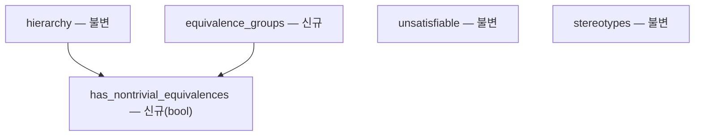
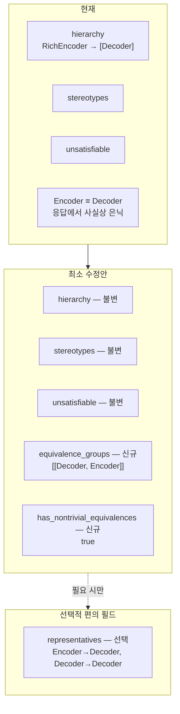
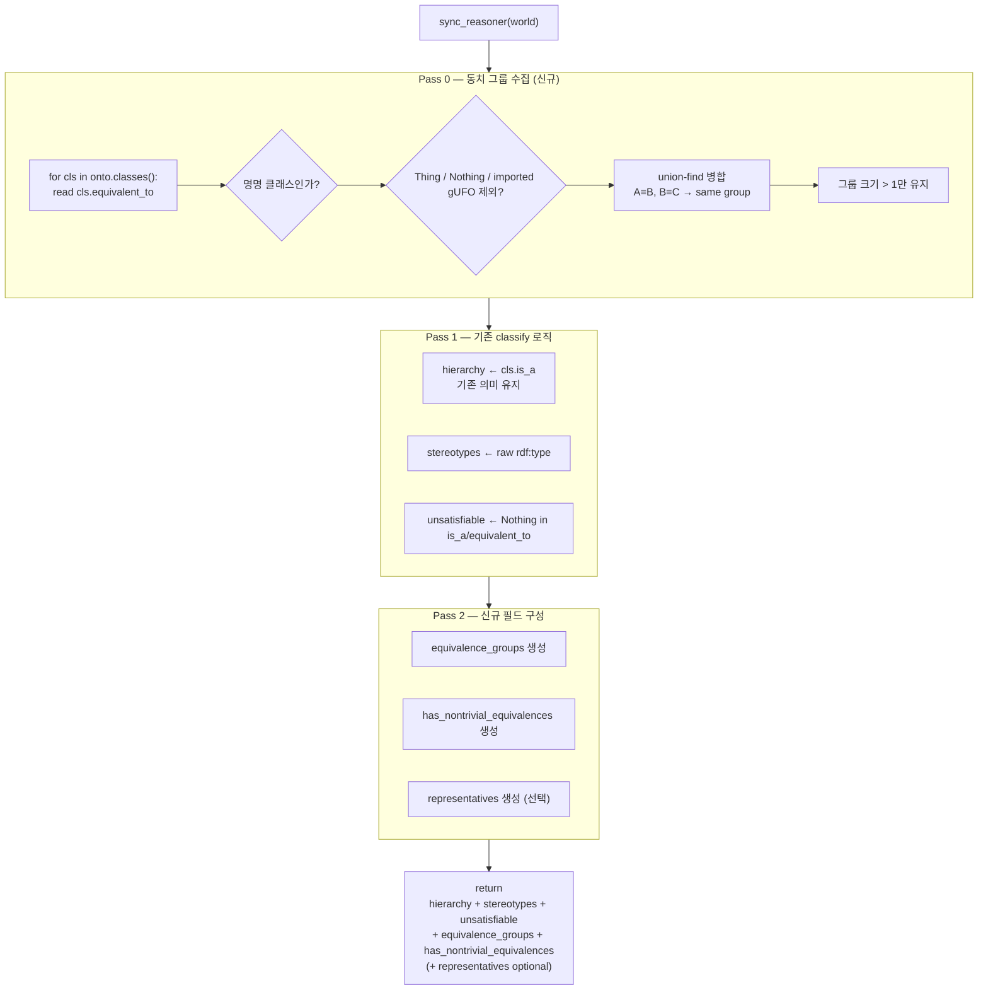
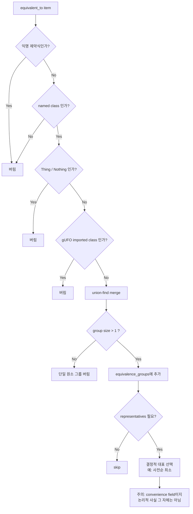
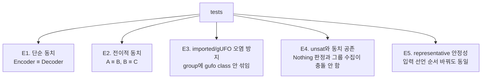
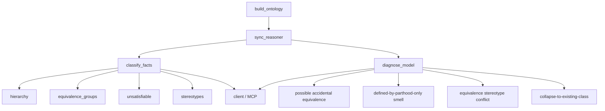
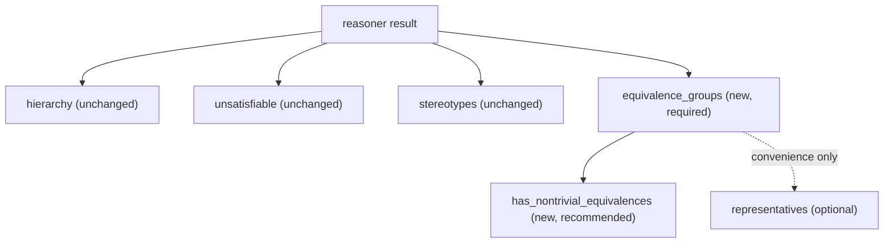

# 설계 리뷰 피드백 (Round 2) — 동치 보고 수정안에 대한 적대적 재검토

- 수신 일시: 2026-07-16 02:14:02 UTC
- 대상: Round 1 이후 확정한 수정안(`hierarchy` 불변 + `equivalence_groups` +
  `representatives`)에 대한 **2차 적대적 검토**
- 선행 문서: [`design_review_20260716_014000.md`](./design_review_20260716_014000.md)
  (Round 1 원문), [`design_review_20260716_014000_summary.md`](./design_review_20260716_014000_summary.md)

> 이 문서는 리뷰어 피드백을 **원문 그대로** 보존한다. 실제 코드 반영 여부·범위는
> 별도 결정 사항이며, 여기 담긴 주장은 검토 대상이지 확정 설계가 아니다.
> 사용자 코멘트(문서 말미)가 최종 우선순위를 규정한다: **원본 소스 수정 최소화 +
> 재사용성 향상 = 프로그램의 성능·효율·가치 향상이 더 중요.**

---

더 날카롭게 말하면:

> 이 안은 `classify()`의 **정보 손실**은 줄이지만,
> `classify()`가 여전히 **잘못 해석되기 쉬운 뷰를 기본 출력으로 유지**한다는 문제는 남깁니다.

현재 코드가 실제로 하는 일은 `cls.is_a`만 읽어 `hierarchy`를 만들고, `equivalent_to`는 `Nothing` 판정에만 쓰는 것입니다. `stereotypes`는 raw `rdf:type`에서 따로 뽑습니다. 즉 지금도 `classify()`는 "전체 논리적 사실"이 아니라 **손실된 요약 뷰**입니다.

## 먼저, 이 안의 강점

이건 분명히 맞습니다.

1. **`hierarchy`를 건드리지 않는 결정**은 옳습니다.
   부모 펼치기를 하면 `hierarchy`가 더 이상 "직계 부모"가 아니라 "동치류 이름 목록"이 됩니다.

2. **`equivalence_groups` 추가**는 반드시 필요합니다.
   지금 결함의 핵심은 동치가 논리적으로 발생했는데 응답에서 사라진다는 점이기 때문입니다.

3. **기존 필드 불변 + 새 필드 추가**는 최소 diff 원칙과 잘 맞습니다.
   현재 `classify()` 계약이 이미 `hierarchy / unsatisfiable / stereotypes` 3축이기 때문에, 그 위에 논리적 사실을 하나 더 얹는 건 자연스럽습니다.

---

# 핵심 반론 1: 이건 "버그 수정"이 아니라 "부가 정보 추가"에 가깝다

당신의 수정안은 old client를 깨지 않으려는 점에서는 훌륭합니다.
하지만 적대적으로 보면:

## Before

* old client는 `hierarchy`만 읽음
* `Encoder`와 `Decoder`를 서로 다른 루트로 해석

## After

* old client는 **여전히** `hierarchy`만 읽으면 똑같이 오해함
* 단지 새 client만 `equivalence_groups`를 읽으면 덜 틀림

즉, 이건 "서버 응답이 잘못된다"를 고친 게 아니라
**"서버 응답에 정답을 복원할 힌트 하나 더 붙였다"**에 가깝습니다.

### 더 직설적으로

이 설계는 **semantic backward compatibility**를 포기하고
**schema backward compatibility**만 지킨 안입니다.

그게 나쁘다는 뜻은 아닙니다.
다만 문서에는 그렇게 써야 합니다.

> "이 변경은 기존 `hierarchy` 해석을 바로잡지 않는다.
> 동치 정보를 별도 필드로 노출하여, 클라이언트가 quotient 해석을 할 수 있게 한다."

이 문장을 못 박아야 합니다.

---

# 핵심 반론 2: `representatives`는 편하지만, 너무 이른 정책 고정일 수 있다

`equivalence_groups`는 사실 보고입니다.
반면 `representatives`는 **정책**입니다.

사전순 최소를 대표로 정하는 건 결정적이라 테스트에는 좋습니다.
하지만 적대적으로 보면 문제가 있습니다.

## 문제점

### 1) 이름 변경에 취약

`Decoder`를 `DecoderBlock`으로 rename하면 대표가 바뀔 수 있습니다.
논리는 안 바뀌었는데 canonical name이 바뀝니다.

### 2) 지역화/다국어에 취약

`사람` vs `Person` 같은 경우 사전순 최소는 ontology적 의미와 무관합니다.

### 3) API가 불필요하게 canonicalization 정책을 강제

서버는 사실을 보고하면 충분한데, representative를 주면
클라이언트는 그걸 "공식 정규 이름"처럼 오해할 수 있습니다.

## 더 적대적인 결론

`representatives`는 **필수는 아닙니다.**
엄밀히 필요한 건 `equivalence_groups`입니다.

### Before

```json
{
  "hierarchy": {...}
}
```

### 최소 필수 After

```json
{
  "hierarchy": {...},
  "equivalence_groups": [["Decoder", "Encoder"]]
}
```

### 더 정책적인 After

```json
{
  "hierarchy": {...},
  "equivalence_groups": [["Decoder", "Encoder"]],
  "representatives": {
    "Encoder": "Decoder",
    "Decoder": "Decoder"
  }
}
```

적대적으로 보면 두 번째보다 세 번째가 **과한 설계**일 수 있습니다.

## 제 판단

* **패치 목적**이면 `representatives`도 실용적
* **장기 계약**이면 premature policy일 수 있음

즉, 이 필드는 "있으면 편한 convenience"이지 "없으면 안 되는 논리 사실"은 아닙니다.

---

# 핵심 반론 3: `equivalence_groups`만 추가하면, 시스템 메시지가 여전히 모순된다

당신 시스템의 표어가:

> **LLM proposes, determinism judges**

라면, accidental equivalence를 그냥 사실로만 내리는 건 반쯤만 judge한 셈입니다.

현재 `classify()`는 이미 `unsatisfiable`을 별도 필드로 내고 있습니다.
즉 "논리적 사실" 중에서도 `Nothing` 동치는 특별취급합니다.

그런데 named equivalence는 "사실만 보고"로 두면 비대칭이 생깁니다.

## 왜 비대칭인가

* `A ≡ Nothing` → 별도 `unsatisfiable`
* `A ≡ B` → 별도 진단 없음

둘 다 reasoner consequence인데, 하나는 시스템이 문제로 다루고 하나는 중립 보고로 둡니다.

적대적으로 보면 사용자는 이렇게 느낄 수 있습니다.

> "왜 논리 붕괴 중 하나는 서버가 잡아주고,
> 다른 하나는 클라이언트가 해석해야 하지?"

## 그래서 최소한 필요한 것

`equivalence_groups`는 facts로 두더라도,
적어도 아래 정도는 있어야 균형이 맞습니다.

```json
{
  "has_nontrivial_equivalences": true
}
```

또는

```json
{
  "group_flags": [
    {
      "group": ["Decoder", "Encoder"],
      "kind": "NONTRIVIAL_EQUIVALENCE"
    }
  ]
}
```

이건 아직 "품질 판정"까지 간 건 아니고,
**사실 중에서도 해석 주의가 필요한 것**을 표시하는 중간 단계입니다.

---

# 핵심 반론 4: `P8` 하나로는 턱없이 부족하다

당신이 적어 둔 테스트 방향은 맞지만, 적대적으로 보면 **가장 쉬운 happy path만 고정**합니다.

최소한 아래 케이스는 같이 고정해야 합니다.

## 반드시 추가할 테스트

### A. 전이적 동치

* `A ≡ B`
* `B ≡ C`
* 기대: `["A","B","C"]` 한 그룹

이걸 안 하면 union-find가 진짜 필요한지 검증이 안 됩니다.

### B. imported / gUFO 클래스 오염 방지

현재 `classify()`는 부모 추출에서 `Thing`, `Nothing`, gUFO namespace를 필터링합니다. 새 동치 수집도 같은 hygiene를 가져와야 합니다.

이걸 테스트하지 않으면:

* group 안에 `Thing`
* group 안에 `gufo:Phase`
  같은 오염이 섞일 수 있습니다.

### C. stereotype conflict

* `A`는 `kind`
* `B`는 `phase`
* reasoner가 둘을 동치로 만들었을 때

이건 지금 백로그로 미루셨는데, 적대적으로 보면 **이번 변경과 함께 바로 드러나는 새 위험**입니다.
적어도 테스트는 있어야 합니다.

### D. self-only equivalence 제거

* 자기 자신만 equivalent_to에 보이거나
* 단일 원소 그룹이 생기는 경우
* 결과에 내지 않아야 함

### E. representative stability

`representatives`를 정말 넣을 거면:

* 입력 선언 순서를 바꿔도 결과가 같아야 함
* 정렬 규칙이 문서와 테스트에 고정돼야 함

---

# 핵심 반론 5: "기존 코드 재사용"은 장점이지만, 여기서는 은근히 위험한 말이다

당신은 "부모 필터와 동일한 hygiene를 재사용"한다고 썼는데, 이건 방향은 맞지만 **그대로 복붙하면 부족할 가능성**이 있습니다.

왜냐하면 현재 필터는 **`is_a` 부모 목록용**입니다.
그런데 `equivalent_to`는 부모보다 더 다양한 걸 가질 수 있습니다.

예를 들어:

* anonymous conjunction
* restriction expression
* imported class
* alias-like named class

즉, 같은 필터를 재사용하더라도 문서상으로는 이렇게 써야 안전합니다.

> "parent filtering logic을 참고하되, `equivalent_to`의 표현식 특성에 맞춘 별도 named-class filter를 둔다."

적대적으로 보면,
"기존 필터 재사용"은 유지보수자에게 **'그냥 같은 조건문 쓰면 되겠지'**라는 잘못된 신호를 줄 수 있습니다.

---

# 더 큰 구조 관점에서의 비판

지금 수정안은 **좋은 패치**입니다.
하지만 "추론기 메커니즘"을 만들고 싶은 관점에서는 여전히 이렇습니다.

## 이 수정안이 실제로 하는 일

* 분류기 응답의 정보 손실 복구

## 이 수정안이 하지 않는 일

* 모델 붕괴 진단
* primitive/defined 오용 예방
* asserted vs inferred provenance 분리
* quotient graph를 1급 객체로 제공

즉, 이건 **reasoner를 더 잘 만든 것**이 아니라
**result adapter를 덜 틀리게 만든 것**입니다.

그 점은 분명히 해야 합니다.

---

# 적대적 최종 판정

## 제가 이 안을 어떻게 평가하느냐

### 찬성하는 부분

* `hierarchy` 불변: 맞음
* `equivalence_groups` 추가: 맞음
* 2-pass grouping: 맞음

### 반대하거나 보수적으로 보는 부분

* `representatives`는 과할 수 있음
* "사실만 보고, 판정은 클라이언트 몫"은 이 시스템 표어와 약간 충돌
* `P8` 단독 고정은 부족
* "기존 hygiene 재사용" 문구는 구현자에게 너무 낙관적으로 들릴 수 있음

---

# 제 권장 수정안

## 가장 안전한 최소안



즉:

* `equivalence_groups` 추가
* `representatives`는 보류 가능
* 대신 `has_nontrivial_equivalences` 같은 아주 얇은 신호 추가

## 실무적으로 더 좋은 안

* `equivalence_groups`
* `representatives`
* `group_flags` 또는 `warnings`

이 셋입니다.

---

# 한 문장으로 요약

> 이 수정안은 **잘못된 침묵을 깨는 데는 충분히 좋지만**,
> **클라이언트가 여전히 잘못 읽을 수 있는 기본 뷰를 유지한다는 점에서 완전한 수정은 아니다.**

---

## 사용자 코멘트 (최종 우선순위 규정)

> 사용자는 원본 소스 코드의 수정을 최소화 하라는 것과 재사용성을 높이라고
> 했습니다. 이것은 코드의 품질을 높이기 위함이고 만들고자 하는 프로그램의 성능,
> 효율 및 프로그램의 가치를 높이는 것이 더 중요합니다.

핵심은 이것입니다.

* `hierarchy`는 그대로 둔다
* `equivalence_groups`는 **필수**
* `representatives`는 **선택**
* 대신 `has_nontrivial_equivalences` 같은 **얇은 신호**를 추가하면, old client도 최소한 "이 결과를 그대로 믿으면 위험하다"는 걸 알 수 있습니다

이 방향은 현재 `classify()`가 이미

* `hierarchy`는 `cls.is_a`에서,
* `stereotypes`는 raw `rdf:type`에서,
* `unsatisfiable`은 `Nothing` 판정에서
  각기 따로 뽑는 구조와도 잘 맞습니다. 즉 "논리적 사실을 종류별로 나눠 반환한다"는 기존 스타일을 유지합니다.

---

# 수정된 최종안 1 — 출력 계약

## 권장안

* `hierarchy`: 불변
* `stereotypes`: 불변
* `unsatisfiable`: 불변
* `equivalence_groups`: 신규, **필수**
* `has_nontrivial_equivalences`: 신규, **권장**
* `representatives`: 신규, **선택**



## 왜 이렇게 나누나

### `equivalence_groups`는 필수

이건 **논리적 사실**이기 때문입니다.
지금 결함의 핵심이 바로 이 정보가 사라진다는 점입니다.

### `has_nontrivial_equivalences`는 권장

이건 old client를 위한 **경보등**입니다.

old client가 `hierarchy`만 읽더라도:

* `false`면 안심하고 봐도 되고
* `true`면 quotient 해석이 필요하다는 걸 최소한 알 수 있습니다

### `representatives`는 선택

이건 사실이 아니라 **정책**입니다.
사전순 최소는 테스트엔 좋지만, 장기 API 계약으론 이른 결정일 수 있습니다.

---

# 수정된 최종안 2 — `classify()` 내부

지금 `classify()`는 `cls.is_a`만으로 부모를 만들고, `equivalent_to`는 `Nothing` 여부에만 씁니다. 이 구조는 유지하되, **동치 수집 1-pass를 앞에 얹는 것**이 최소 diff입니다.



---

# 수정된 최종안 3 — 함정 가드

이 부분이 중요합니다.
"2-pass면 된다"가 아니라, **어디서 망가지는지**를 아예 그림으로 박아두는 게 좋습니다.



---

# 테스트도 같이 재설계해야 합니다

이건 patch보다 중요할 수 있습니다.

지금 제일 필요한 테스트는 아래 5개입니다.



---

# 구조를 조금 더 바꾸는 장기안

당신이 "구조를 뒤엎는 것까지 고려"한다고 했으니,
장기적으로는 `classify()` 하나에 너무 많은 기대를 싣지 않는 편이 맞습니다.

현재 파일 안에도 이미 precedent가 있습니다.

* `classify()`는 논리 결과 요약
* `validate_gufo()`는 별도 진단성 함수

즉, **facts와 diagnostics를 분리하는 방향은 현재 코드 철학과도 충돌하지 않습니다.**



---

# 제가 최종적으로 밀고 싶은 버전

가장 실용적으로는 이겁니다.

## 이번 PR/패치 범위

* `equivalence_groups` 추가
* `has_nontrivial_equivalences` 추가
* `hierarchy` 불변
* `representatives`는 **선택**, 정말 필요할 때만

## 백로그

* `facts / diagnostics` 분리
* `EQUIVALENCE_STEREOTYPE_CONFLICT`
* `asserted vs inferred provenance`
* defined-by-parthood-only 상류 린트

---

# 아주 짧은 최종 MMD


