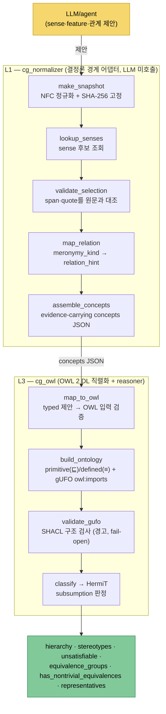
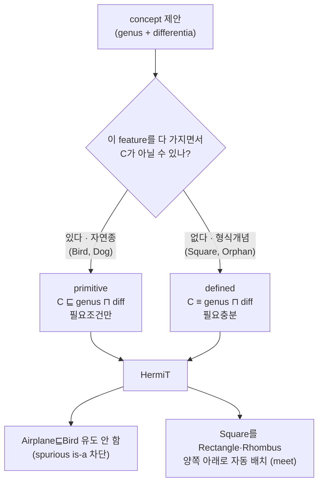
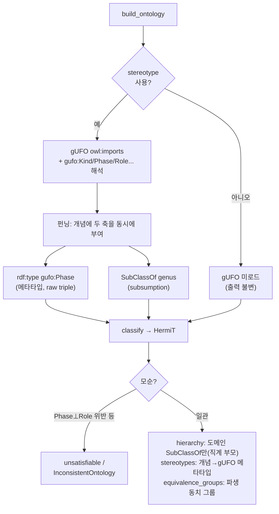

# ConceptGate 메커니즘

핵심 명제: **LLM이 제안하고, 결정론이 판정한다.** 자연어를 evidence-carrying
개념으로 고정한 뒤, 형식·정의 개념의 is-a 계층은 **풀 DL reasoner(HermiT)가
생성**한다. LLM은 originate하지 못하고, 각 층은 확인 가능한 것만 통과시킨다.

## 1. 전체 파이프라인

각 stage의 오류는 `{stage, code, detail}` 구조로 보고된다 — 실패가 어느 단계
책임인지 즉시 식별된다. `confidence`(LLM 불확실성)와 `verification_status`
(L1~L3 증거 수준)는 절대 섞지 않는다.

## 2. 왜 계층을 reasoner가 만드는가 — primitive vs defined

리뷰 발견 2의 근본 원인은 "feature 더 많음 = 자식"이었다. 해결은 개념마다
**충분조건 존재 여부**를 판정해 OWL 공리 형태를 가르는 것이다.

- **primitive**: X가 조건을 만족해도 `X ⊑ C`를 유도하지 **않는다** → 날개
  가진 Airplane이 Bird로 잘못 분류되지 않음.
- **defined**: `X ⊑ 조건 ⟺ X ⊑ C` → reasoner가 다중 부모를 자동으로 찾음.

## 3. gUFO 정합 — owl:imports + stereotype 펀닝 (finding 3·4)

stereotype이 쓰이면 gUFO endurants-only 서브셋을 `owl:imports`로 선언하고,
개념에 **실 gUFO IRI**로 메타타입을 부여한다. 그러면 gUFO의 공리
(Kind⊥SubKind, Phase⊥Role, Rigid⊥NonRigid)를 HermiT가 네이티브로 적용한다.

핵심 설계 결정 두 가지:
- **펀닝은 raw triple로 주입한다.** owlready2의 `.is_a`는 `rdf:type`과
  `rdfs:subClassOf`를 하나로 합쳐 보여줘 메타타입과 subsumption이 혼동된다.
  그래서 `classify()`는 raw triple로 rdf:type을 따로 읽고, `hierarchy`에는
  도메인 SubClassOf만 남긴다(gUFO 네임스페이스 조상은 필터링).
- **`validate_gufo`는 경고 반환(fail-open)이다.** anti-rigid(Phase·Role)이
  rigid Kind를 특수화하는지 SHACL로 reasoner 실행 *전에* 검사하되, 위반은
  경고이지 흐름 차단이 아니다. pyshacl 미설치면 경고 하나로 생략한다.
- **파생 동치는 `equivalence_groups`로 보고하고 `hierarchy`는 안 펼친다.**
  두 defined 개념이 같은 정의라 `A ≡ B`가 되면 그 사실을 별도 필드로 낸다
  (`hierarchy`에 별칭을 넣으면 "직계 부모" 의미가 깨진다). 단 gUFO import 시
  HermiT가 동치류의 SubClassOf를 대표에만 부여해 나머지 멤버의 부모가
  유실되므로, `classify()`는 그룹 부모를 합집합해 전원에게 복원한다(그룹
  자신은 제외해 별칭이 부모로 새지 않게 한다). `representatives`(동치류당
  사전순 최소)로 클라이언트가 동치류를 한 노드로 접는 quotient graph를
  만들 수 있다 — 같은 부모가 alias마다 중복 노출되는 것을 피한다.
- **hierarchy는 entailed OWL hierarchy이지 candidate feature hierarchy가
  아니다.** `classify_owl`의 계층은 OWL 공리의 model-theoretic 함의이고,
  `run_pipeline`의 DAG는 feature-label 집합 포함으로 만든 후보다 — 인식론적
  등급이 다르므로 같은 검증 수준으로 읽으면 안 된다.

## 4. 검증이 행동으로 증명하는 것

| 증명 | 테스트 |
|---|---|
| primitive는 spurious is-a를 안 만든다 | `test_cg_owl.py` P1~P4 |
| Phase 펀닝: rdf:type gufo:Phase **그리고** SubClassOf | P5 |
| owl:imports가 장식이 아니다 (Phase⊥Role 공리 발화) | P6 |
| unsatisfiable 클래스가 Nothing을 parents로 안 흘림 | P7 |
| 파생 동치를 그룹으로 보고(전이 폐포·unsat 격리·별칭 비오염) | P8 |
| gUFO 경로에서 동치 멤버 전원이 직계 부모를 유지 | P9 |
| 어떤 변형 입력도 crash하지 않는다 (CRASH=0) | `fuzz_normalizer_types.py` |
