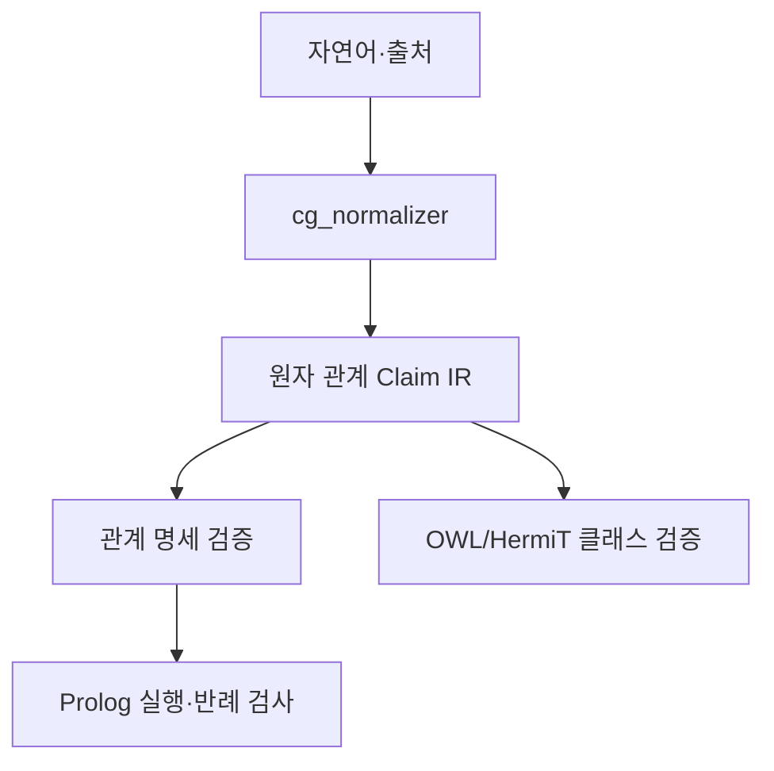

# prolog-reasoner 결합 Dynamic Workflow 운영 계획

- **기원**: 외부 검토(2026-07-22) — `prolog-reasoner`를 ConceptGate의 새 코어가
  아니라 **선택적 L2 backend**로 결합할지 판단하는 실험 설계.
- **정정 이력**: 초판(2026-07-21)은 "dynamic workflow = 격리된 subagent 세션"
  이라는 잘못된 전제로 작성됐다. Claude Code 공식 문서 확인 후 전면 재작성 —
  Dynamic Workflows는 Claude가 작성한 **JavaScript 스크립트**가 `agent()`/
  `pipeline()` 프리미티브로 서브에이전트를 대량 조율하는 v2.1.154+ 정식 기능
  이다. 이 문서는 실험 설계를 그 스크립트 실행 단위로 재구성한다.

## 0. 이 workspace에서 사용 가능 여부 (검증 완료, 2026-07-22)

| 조건 | 상태 | 근거 |
|---|---|---|
| Claude Code 버전 ≥ 2.1.154 | 충족 | `claude --version` → 2.1.216 |
| 계정 요금제(Pro/Max/Team/Enterprise/API) | 충족 | `oauthAccount.organizationType = "claude_pro"` |
| 서버 기능 플래그 | 충족 | `cachedGrowthBookFeatures.tengu_workflows_enabled = true` |
| 로컬 비활성화 여부 | 비활성화 안 됨 | 전역/프로젝트 settings에 `disableWorkflows` 없음, `CLAUDE_CODE_DISABLE_WORKFLOWS` 미설정 |
| 저장된 워크플로우 | 없음(정상) | `~/.claude/workflows/`, `<repo>/.claude/workflows/` 둘 다 미생성 — 사용 가능 여부와 무관, 아직 하나도 저장 안 한 것뿐 |

**결론**: 사용 가능. `ultracode` 키워드 또는 "워크플로우 사용해줘"류 자연어
요청으로 트리거하며, 최초 실행 시 CLI가 실행 승인 프롬프트를 띄운다(§7).
`/config`의 Pro 전용 "동적 워크플로우" 활성화 행 자체의 on/off는 read-only로
확인할 파일이 없어 미확정이지만, 서버 feature flag가 이미 true이므로 실행
시점에 막히면 그 프롬프트에서 바로 켤 수 있다 — 사전 조치 불필요.

## 1. 결합 위치와 금지 원칙 (설계 그대로 보존)

**결합 지점**: `cg_normalizer.py`의 claim 생성 직후(`composition_view()` 이후가
아니라). `cg_normalizer`는 이미 `{subject, predicate, object,
verification_status}` 형태의 원자 claim을 만든다 — 이것이 Prolog 입력 경계다.



**금지 원칙** (모든 Phase에 적용, 위반 시 즉시 REJECT 후보):
1. 검증되지 않은 임의 Prolog 문자열을 실행하지 않는다. 경로는 항상
   `검증된 JSON claim → predicate 화이트리스트 검사 → 고정 compiler → 고정
   rule base`.
2. `\+ p(X)` 성공은 `¬p(X)` 증명이 아니다(negation-as-failure). 모든 결과는
   4값 verdict로만 표현한다: `ENTAILED / CONTRADICTED / BOTH / UNKNOWN`.
   `UNKNOWN`을 `CONTRADICTED`로 바꾸는 스크립트/agent 지시 금지.
3. `does_not_entail`(자동 함축 안 함)과 `disjoint_with`(양립 불가)는 별개
   개념 — 관계 명세에서 혼동 금지.

**역할 분담** (기존 모듈 재사용, 재구현 금지):

| 기존 부분 | 결합 방법 |
|---|---|
| `conceptgate/cg_normalizer.py`의 claims | Prolog fact 입력 |
| `RELATION_CROSSWALK` | 관계 inventory 초기 seed |
| `relation_hint` | 힌트 → 1급 predicate로 승격 |
| `CompositionGate`(`concept_gate_v7.py`) | 기존 회귀 기준 유지, 재작성 불필요 |
| `UFOAntiPatternGate` | Prolog 결과와 교차검증만 |
| `conceptgate/cg_owl.py` + HermiT | 클래스 subsumption·일관성 전담, Prolog가 대체 안 함 |

## 2. Dynamic Workflow 매핑 원칙

실험의 각 트랙을 실제 워크플로우 스크립트 단위로 번역하는 규칙:

- **트리거**: 각 Phase를 실행할 때 프롬프트에 `ultracode` 키워드를 포함하거나
  "워크플로우로 실행해줘"라고 요청한다. Claude가 그 작업을 위한 JS 스크립트를
  작성 — 스크립트를 직접 작성하지 않는다.
- **결정론적 요소**(Track A의 Gold IR 질의)는 입력이 같으면 출력이 항상
  같으므로 워크플로우의 이득(대량 병렬·재사용 가능한 조율)이 크지 않다.
  `agent()` 1회 호출로 충분하면 일반 세션에서 처리하고, Track B와 하나의
  파이프라인으로 묶을 때만 같은 스크립트의 한 단계로 편입한다.
- **자연어 요소**(Track B)가 워크플로우의 실제 이득 지점: fixture 목록을
  `pipeline(fixtures, fixture => agent(...))`로 병렬 실행하고, 결과를 스크립트
  변수에 모아 결정적으로 재채점한다. 각 `agent()` 호출은 독립 실행이므로
  E2 재설계의 cold-context trial 원칙(동일 model/temperature, 자기보고 배제,
  오류 유형 분리 필드)이 자연스럽게 유지된다.
- **적대 검증**: Phase 6(판정 기준 도달) 직전에 `adversarial-review` 스킬로
  이 설계 자체를 한 번 더 공격한다 — E2 초안이 적대 리뷰로 3개 치명 결함을
  찾아 재설계됐던 전례를 따름. 이 단계는 워크플로우가 아니라 스킬 호출(현재
  세션 안에서 1회성 검토)로 수행.
- **비용 원칙**: 대규모로 커밋하기 전에 작은 범위(관계 1개, fixture 소수)로
  먼저 실행해 `/workflows` 뷰의 토큰 사용량을 확인한다. 25개 에이전트 또는
  150만 토큰 추정치를 넘으면 `Large workflow` 경고가 뜬다 — 이 경고는 실행을
  막지 않지만 Phase 4의 8관계×8시나리오(64칸) 전체를 한 번에 돌리면 넘기기
  쉬우므로, Phase 0에서 "3관계만 우선"으로 범위를 좁힌 것이 이 실무 제약과도
  맞아떨어진다.

## Phase 0 — Relation Spec 고정 (사람 작업, 워크플로우 아님)

`member_of` / `part_of` / `instance_of` 3종만 우선 명세한다(8관계 전부 한
번에 하지 않음). 예시 스키마:

```yaml
relation: member_of
arguments:
  subject: agent
  object: social_group
inverse: has_member
properties:
  transitive: false
  symmetric: false
  time_indexed: true
does_not_entail: [part_of, instance_of]
disjoint_with: []
identity:
  membership_change_does_not_necessarily_destroy_group_identity: true
```

**게이트**: 3종 명세가 사람 승인을 받기 전에는 Phase 1 진입 금지. 이 Phase는
워크플로우로 실행하지 않는다(사람이 직접 YAML 작성·검토).

## Phase 1 — Track A (Gold IR → Reasoner)

사람이 정답 관계를 직접 JSON claim으로 작성(자연어 번역 단계 제거) →
prolog-reasoner에 실행 → 5종 질의로 4값 verdict 확인:

```text
member_of(재현, 연구모임)   → ENTAILED
has_member(연구모임, 재현)  → ENTAILED
part_of(재현, 연구모임)     → UNKNOWN
instance_of(재현, 연구모임) → UNKNOWN
member_of(재현, 연합회)     → UNKNOWN
```

- **실행 방식**: 결정론적 — 워크플로우 없이 일반 세션에서 `agent()` 상당의
  단일 실행으로 처리 가능. 최초 실행은 작은 범위(관계 1개)로 먼저 돌려
  이상 없음을 확인 후 3관계 전체로 확장(§2 비용 원칙).
- **산출물 위치**: `experiments/<date>_prolog_relation_backend/track_a/`
  하위 `gold_ir.json`(입력 claim) + `queries.json`(질의+기대 verdict) +
  `evaluate.py`(재실행 시 동일 verdict 재현을 결정적으로 검증).
- **게이트**: 3종 관계 모두 기대 verdict와 일치해야 Phase 2 진입.

## Phase 2 — Track B (자연어 → IR → Reasoner) — 실제 Dynamic Workflow

Phase 0에서 고정한 3관계분 예문·출처 세트로 전체 파이프라인(정규화→
predicate 선택→Prolog compile→reasoning→자연어 보고)을 실행한다. 이 Phase가
Dynamic Workflows를 실제로 쓰는 지점이다.

**트리거 프롬프트 예시**:
```text
ultracode: member_of/part_of/instance_of 3관계, 관계당 8시나리오 예문에
대해 정규화→predicate 선택→Prolog compile→reasoning→보고 파이프라인을
독립 실행하고, 각 결과에 오류 유형 7종(sense/predicate/argument방향/
evidence연결/compile/reasoning/보고)을 분리 기록해줘.
```

**스크립트가 가져야 할 형태** (Claude가 작성 — 아래는 기대하는 구조 스케치,
`docs` 예시의 `export const meta / agent() / pipeline()` 패턴을 따름):

```javascript
export const meta = {
  name: 'prolog-track-b',
  description: 'Track B: 자연어→IR→Prolog reasoning, 관계별 오류유형 분리 기록',
}

// args: { fixtures: [{relation, scenario, text, expected_verdict}, ...] }
const results = await pipeline(args.fixtures, fx =>
  agent(
    `다음 문장을 원자 관계 claim으로 정규화하고 Prolog로 판정하라: "${fx.text}"
     관계: ${fx.relation}, 시나리오: ${fx.scenario}.
     오류가 나면 어느 단계(sense/predicate/argument_direction/evidence_link/
     compile/reasoning/report)인지 명시하라.`,
    { label: `${fx.relation}:${fx.scenario}`,
      schema: { /* verdict, error_stage, claim_ir 등 필드 스키마 */ } },
  ),
)
return results
```

- **오류 유형 분리 로깅**: 위 스키마의 `error_stage` 필드로 강제 — 어느
  단계 실패인지 뭉개지지 않게 한다(sense 선택 / predicate 선택 / argument
  방향 / evidence 연결 / Prolog compile / reasoning / 최종 보고).
- **replicate 수 결정 절차**: 첫 실행은 pilot 규모(관계당 시나리오 2~3개,
  `args.fixtures`를 소량으로 시작)로 돌려 `/workflows` 뷰에서 분산·비용을
  확인 → confirmatory run 규모(전체 3관계×8시나리오)를 그 이후 결정. 사전
  등록 규칙(≥3/5 격차에서만 실증 주장)은 E2와 동일하게 유지.
- **저장**: pilot이 잘 작동하면 `/workflows`에서 실행을 선택해 `s`를 눌러
  `.claude/workflows/prolog-relation-track-b.js`(프로젝트 위치, 저장소 공유)
  로 저장한다. confirmatory run은 `Run /prolog-relation-track-b with the full
  3-relation fixture set`처럼 `args`만 바꿔 재실행 — 스크립트를 다시 작성할
  필요 없음.
- **게이트**: pilot 완료 후 분산이 과도하게 크면(관계별 정확도 표준편차가
  방향성 판단을 무의미하게 할 정도) confirmatory run 규모를 재산정 — 자동
  진행 금지, 사람 판단 지점.

## Phase 3 — C0/C1/T/R 비교 실행 순서

목적은 원자 관계 IR 도입 효과(C1−C0)와 Prolog 고유 효과(T−C1)를 분리하는
것 — 이 순서를 어기면(C0/T만 비교) 두 효과가 뒤섞인다.

**단일 재사용형 스크립트 권장**: 조건별로 별도 파일을 만들지 않고 `args`로
조건을 받는 한 스크립트로 관리한다 — C1−C0/T−C1의 순서 강제(아래 1→2→3)가
스크립트 로직으로 코드화되어, 실행할 때마다 사람이 순서를 기억할 필요가
없어진다.

```javascript
export const meta = { name: 'prolog-condition-eval' }
// args: { condition: "C0" | "C1" | "T", fixtures: [...] }
if (args.condition === 'T' && !hasStoredResult('C1')) {
  throw new Error('C1 결과 없이 T를 실행할 수 없음 — C0→C1→T 순서 강제')
}
const results = await pipeline(args.fixtures, fx => agent(buildPrompt(args.condition, fx)))
return results
```

1. C0(현재 ConceptGate) 기준선 확정 → `condition: "C0"`로 1회 실행.
2. C1(ConceptGate + 원자 관계 IR + Python 검증) 실행 → `C1−C0` 확정 후에만
   다음 단계 진행.
3. T(C1 + Prolog 실행 backend) 실행 → `T−C1` 산출.
4. R(기존 OWL/HermiT 경로, `cg_owl.py`)은 신규 구현 없이 참고 비교군으로만
   병기 — 워크플로우로 실행하지 않고 기존 `cg_owl.py` 결과를 그대로 인용.

## Phase 4 — Fixture 매트릭스

8관계군 × 8시나리오(직접 긍정 / inverse / 허용 다단계 / 금지 다단계 /
domain·range 위반 / 명시적 모순 / 시간 변화 / has-a 최소 대조쌍) = 64칸이
전체 설계지만, **Phase 0~3은 3관계(member_of/part_of/instance_of)분만
소비**한다(24칸) — §2 비용 원칙과 `/config` 크기 지침(`medium`<15,
`large`<50 에이전트) 안에 들도록. 나머지 5관계(subclass_of, material_of,
owns, plays_role, participates_in, located_in)는 Phase 6에서 `ADOPT_*` 판정이
나온 뒤에만 확장 — 조기 확장 금지.

각 시나리오는 Track A(결정론 질의)와 Track B(자연어 workflow trial) 중
어느 쪽 fixture로 소비되는지 Phase 0 명세 승인 시 함께 태깅한다.

## Phase 5 — 채점

`experiments/` 컨벤션(자기보고 배제, stdlib+repo 모듈만, 결정적 재현)을
그대로 따르는 `evaluate.py`를 Track A/B 공용으로 작성 — 워크플로우 스크립트가
반환한 `results` 배열을 세션이 받으면 로컬 파일로 저장 후 이 스크립트로
재채점한다(워크플로우 자체는 채점을 하지 않음, 조율만).

**1차 지표**: 관계 판별 macro-F1, unsafe entailment rate(`UER` = 금지
추론을 도출한 수 / 금지 추론 fixture 수), explicit contradiction
precision/recall, `UNKNOWN` 보존율, 허용 다단계 추론 정확도.

**2차 지표**: proof trace-규칙 일치율, compile/execution 실패율, p50/p95
latency, 메모리·배포 크기, SWI-Prolog 부재 시 graceful degradation, 기존
`qa_v7.py` 101/101 + OWL 회귀 통과 여부(비회귀 기준으로 고정). 워크플로우
실행 자체의 토큰 총계·에이전트 수는 `/workflows` 뷰 기록을 그대로 인용.

## Phase 6 — 판정 기준과 다음 액션

적대 리뷰(§2 원칙) 통과 후 아래 4종 중 하나로 귀결:

| 판정 | 조건 | `docs/obligation_layer_roadmap.md` 편입 |
|---|---|---|
| `ADOPT_PROLOG_BACKEND` | T가 C1보다 multi-hop/제약 정확도 ≥10%p 개선, UER 감소, 직접관계 정확도 저하 ≤2%p, 101 QA+OWL 회귀 전부 통과, 오류가 UNKNOWN으로 안전 격리, latency·배포 부담 허용 범위 | 신규 마일스톤(M6 후보)으로 별도 커밋에서 추가 — 이 문서에는 슬롯만 남김 |
| `ADOPT_RELATION_IR_ONLY` | C1이 C0보다 크게 개선되나 T−C1 차이 미미 | 기존 Python Gate 확장으로 편입, Prolog backend는 보류 |
| `KEEP_AS_EXTERNAL_TOOL` | 복잡 fixture엔 유용하나 일반 요청엔 지연·배포 부담 큼 | MCP 별도 유지, 필요 시에만 선택적 호출 — 로드맵 편입 없음 |
| `REJECT_INTEGRATION` | 번역 오류가 대부분, UER 증가, UNKNOWN→부정 오판 발생, 운영 부담이 이득보다 큼 | 로드맵 편입 없음, 이 문서를 기각 기록으로 보존 |

이번 문서는 판정을 내리지 않는다 — Phase 0~5 실행 후 그 결과로만 결정.

## 7. 실행 시 주의사항 (문서 §Approve the plan / Behavior and limits 반영)

- 최초 워크플로우 실행 시 CLI가 단계 목록과 함께 실행 승인 프롬프트를
  띄운다(권한 모드가 기본값/편집 수락이면 매 실행마다, 자동 모드면 최초
  1회만). **예, 다시 묻지 않기**를 선택하면 이후 같은 워크플로우는 프롬프트
  없이 실행된다.
- 워크플로우가 만드는 서브에이전트는 항상 `acceptEdits` 모드로 실행되고
  세션의 도구 허용 목록을 상속한다 — 허용 목록에 없는 셸 명령/MCP 도구는
  실행 중에도 별도로 프롬프트할 수 있으므로, 긴 실행 전에는 필요한 명령을
  미리 허용 목록에 추가해 둔다.
- 실행 중 사용자 입력을 받을 수 없다(에이전트 권한 프롬프트만 예외) — 단계
  간 사람 승인이 필요하면(예: Phase 0→1 게이트) 각 단계를 별도 워크플로우로
  나눠 실행한다.

## Out of Scope (이번 문서 산출 범위 밖)

- `cg_relation_spec.py`/`cg_relation_ir.py`/`cg_prolog_compile.py`/
  `cg_prolog_backend.py`/`cg_relation_verdict.py` 등 신규 모듈 생성 없음.
- `prolog-reasoner` subtree 병합 없음(`CLAUDE.md` Subtree Registry에 항목
  추가 없음 — 이는 `ADOPT_PROLOG_BACKEND` 판정 이후에만 검토).
- 실제 워크플로우 실행·저장 없음 — 이 문서는 실행 전 운영 계획이다.
